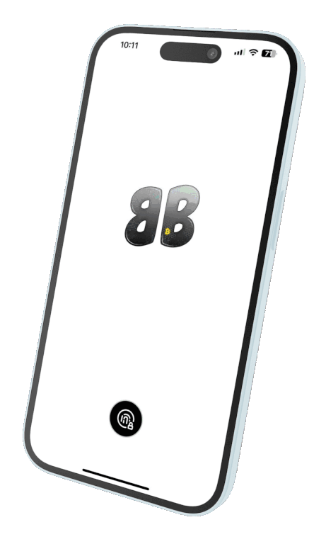

# Bold Bitcoin Wallet

## Your Superior Bitcoin Wallet

### Seedless. Hardware-Free. Limitless.

No seeds, no hardware wallets, no dependencies. Pure and Resilient Bitcoin Security, powered by superior Threshold Signatures technology, for ultimate self-custody control.

<figure><figcaption></figcaption></figure>

### Table of Contents

* [Introduction](./#introduction)
* [How It Works](./#how-it-works)
* [Features](./#features)
* [Security Model](https://chatgpt.com/c/67c03778-3988-8013-b07a-3883ce8b4038#security-model)
* [Community](./#community)
* [Terms & Agreements](./#terms-and-agreements)

### Introduction

Bold Bitcoin Wallet is an open-source, self-custodial Bitcoin wallet designed for maximum security and ease of use. Unlike traditional wallets, Bold eliminates the need for seed phrases or hardware wallets, leveraging threshold signature schemes (TSS) for robust security.

### How It Works

1. **Install on Two or Three Devices** – Set up the wallet on two separate devices.
2. **Setup or Restore** – Either create a new wallet or restore from key shares.
3. **Manage Your Bitcoin** – Securely send, receive, and hold Bitcoin.
4. **HODL with Peace of Mind** – Your private keys are never exposed or stored in a single place.



### Features

#### **Why Choose Bold Bitcoin Wallet?**

* **Seedless Setup** – No seed phrases required. Backup via cloud, email, or messaging apps.
* **Two-Device Threshold Security** – Unmatched security with two-device authentication using TSS.
* **Self Custody** – All transactions happen locally between your devices, with no third-party involvement.
* **Open Source** – Fully auditable and transparent codebase.

### Security Model

#### **Privacy First**

* No personal data collection.
* All crypto actions occur locally and are encrypted.
* Public Bitcoin APIs are accessed anonymously.

#### **User Responsibility**

* Secure your devices against malware and threats.
* Keep backup shares safe and private.
* Understand that lost keys cannot be recovered.

#### **Self-Custody Grade**

* Bold is open-source and available for public audit.
* Provided "as is"—no guarantees of error-free use.
* Developers are not liable for loss or unauthorized access.

### Community

Join and contribute to the Bold Bitcoin Wallet community:

* [Twitter (X)](https://x.com/boldBTCWallet)
* [Discord](https://discord.gg/p4ectmVtJ2)
* [GitHub](https://github.com/BoldBitcoinWallet/)

### Terms & Agreements

Please review the following before using Bold Bitcoin Wallet:

* [Terms of Service](https://github.com/BoldBitcoinWallet/Terms/blob/main/Terms%20Of%20Service.md)
* [Privacy Policy](https://github.com/BoldBitcoinWallet/Terms/blob/main/Privacy%20Policy.md)

By using Bold Bitcoin Wallet, you agree to:

* Use the app lawfully and responsibly.
* Accept the risks of managing Bitcoin independently.

### Travel with Confidence

With Bold Bitcoin Wallet, your private keys are not tied to any device or paper. Backup your key shares, uninstall the app, and restore anytime. Your Bitcoin, your control—secure, resilient, and incognito.
